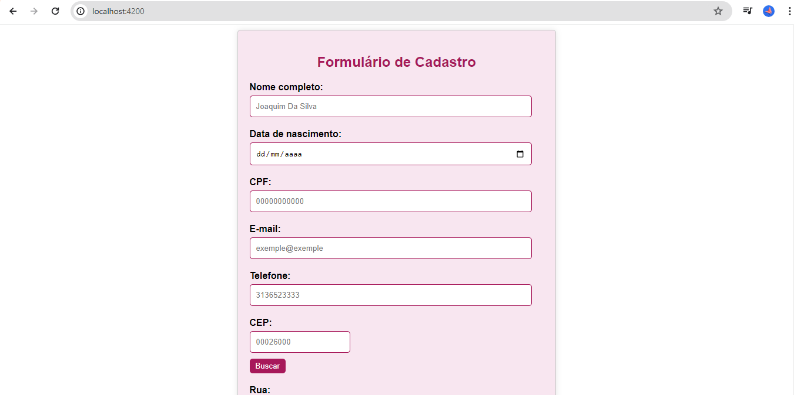

# Projeto de Formulário Angular com Busca de CEP

**Descrição do Projeto:**

Atividade do professor Montanha da Unidade Curricular de Usabilidade, Web, Mobile e Games que consistia em um projeto de um formulário que solicita as seguintes informações do usuário:

1. Nome completo
2. Data de nascimento
3. CPF
4. E-mail
5. Telefone
6. CEP
7. Endereço completo (rua, número, complemento, bairro, cidade, estado)

O projeto inicial fornecido pelo professor já possuia um serviço que busca informações de endereço a partir do CEP utilizando o serviço ViaCEP.

**Requisitos:**

1. O formulário deve ser construído usando Angular.
2. Ao digitar o CEP, o formulário deve buscar automaticamente as informações de endereço e preenchê-las nos campos correspondentes.
3. O formulário deve ter validações para todos os campos, garantindo que as informações inseridas estejam corretas.
4. O design do formulário deve ser agradável e intuitivo para o usuário.
5. O código deve ser limpo, bem comentado e seguir as melhores práticas de desenvolvimento Angular.

**Requisitos necessários para desenvolver o projeto:**

Este projeto foi feito usando <a href="https://github.com/angular/angular-cli">Angular CLI</a> 17.3 e API web <a href="https://viacep.com.br/">Viacep</a> usando armazenamento local.
Para instalação do Angular usei os comandos contidos na documentação do Angular <a href="https://angular.io/guide/setup-local">

**Servidor de desenvolvimento**
Execute ``ng serve -o`` na pasta de um servidor de desenvolvimento. Navegue para http://localhost:4200/. O aplicativo será recarregado automaticamente se você alterar algum dos arquivos de origem.

**Entrega**

Aqui está o meu site de um formulário angular simples: <a href="https://formulario-angular-cadastro-simples.vercel.app/">Fomulário em Angular</a>. Os comentários de tags e comandos usados estão no código.

